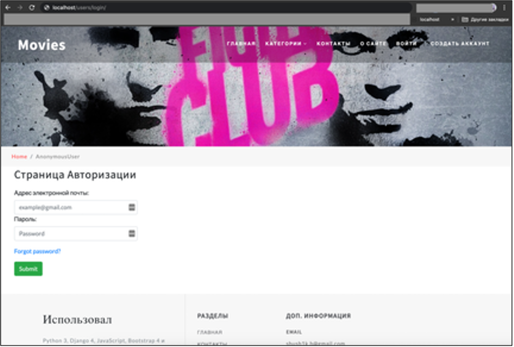
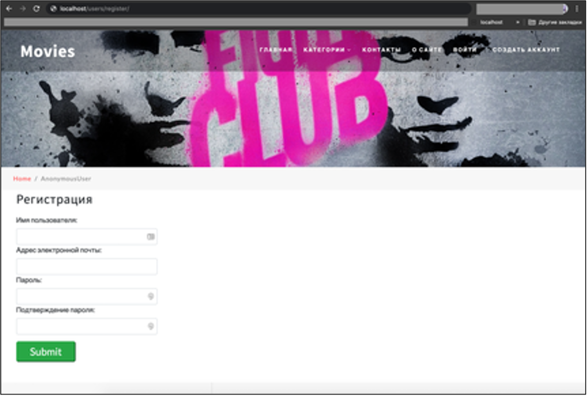
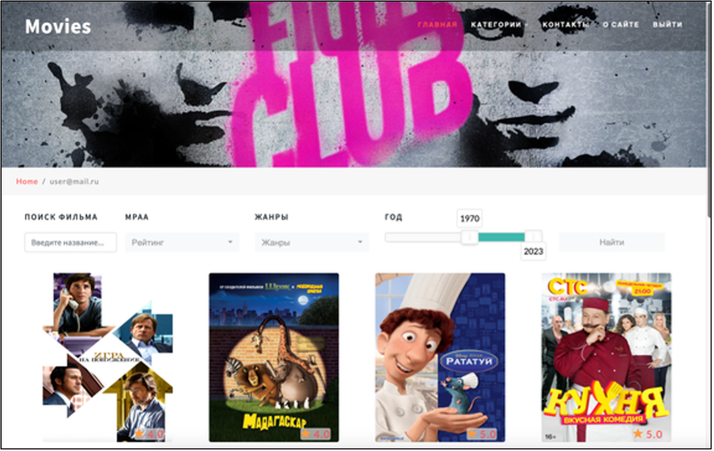
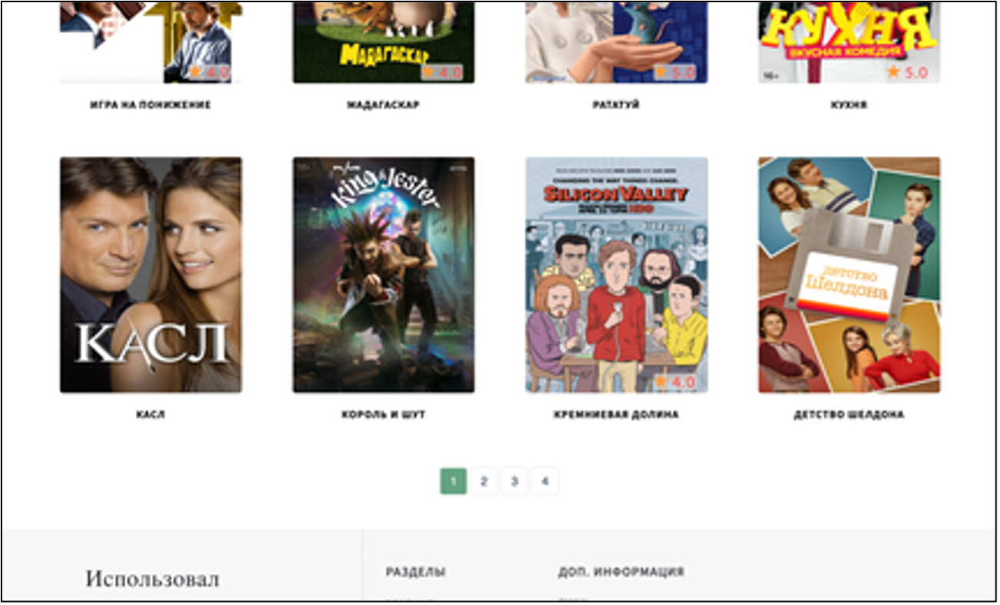
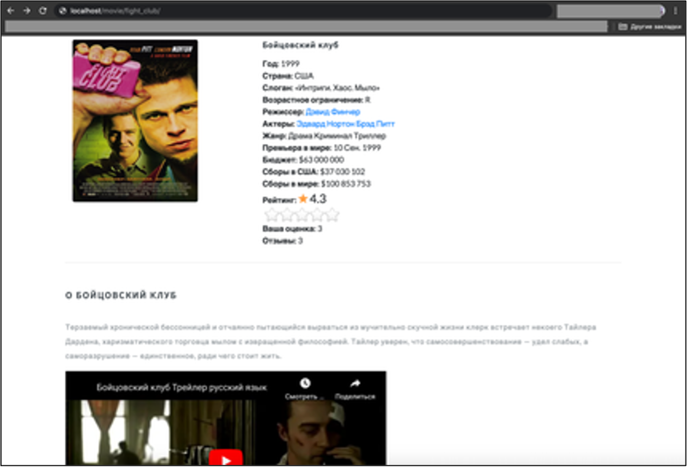
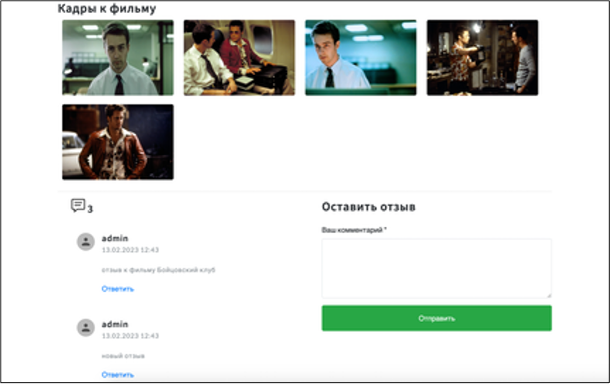

 

# Дипломная работа 2023 г
### Финансовый университет при Правительстве Российской Федерации
### Выполнил: Баранов Александр, группа ПИ19-3
### Тема: Разработка сервиса для формирования рейтинговой системы оценок в сфере индустрии киноразвлечений

Сайт позволяет пользователям получать детальную информацию о фильмах и его рейтинге, писать отзывы и ставить оценки фильмам и сериалам.
Пользователи могут воспользоваться инструментами фильтрации и поиска. Для некоторых действий необходима авторизация.

Возможности:
------------
- Регистрироваться и быть авторизованным на сайте (верификация почты с генерацией токена)
- Ставить оценки и писать отзывы фильмам
- Поиск и фильтрация фильмов/сериалов по жанрам, рейтингу, году производства
- Просмотр по категории (фильмы, сериалы, мультфильмы, аниме)
- Пагинация фильмов по 8 карточек на странице
- Детальная страница для фильма, актера
- Администрировать сайт (добавление, удаление, изменение - фильмов, актеров, жанров, категорий)
- Feedback система
- Посмотреть страницу об авторе

Стек технологий:
----------------
- Python 3.9
- Django 4.0
- Postgres 15
- Docker
- NGINX
- Gunicorn

## Веб-интерфейс сделан на Django Templates и Bootstrap 4:

<!-- 1 -->

    <h4>Страница Авторизации</h4>
    
    
При авторизации выполняется проверка верификации почты пользователя. Открывается возможность ставить фильмам оценки и писать отзывы.

<!-- 2 -->

    <h4>Страница Регистрации</h4>
    
    
При регистрации отправляется письмо на почту пользователя с ее подтверждением

<!-- 3 -->

    <h4>Главная страница фильмов (часть 1)</h4>
    
    
Панель навигации, баннер, инструменты фильтрации и поиска, карточки с фильмами

<!-- 4 -->

    <h4>Главная страница фильмов (часть 2)</h4>
    
    
Пагинация по 8 карточек и подвал сайта (footer)

<!-- 5 -->

    <h4>Страница Фильма (часть 1)</h4>
    
    
Детальная информация фильма, трейлер, рейтинг, количество отзывов

<!-- 6 -->

    <h4>Страница Фильма (часть 2)</h4>
    
    
Кадры и отзывы к фильму

<!-- 7 -->

    <h4>Страница Об авторе</h4>
    
    
Описание возможностей сайта, контактная информация, приобретенные навыки

